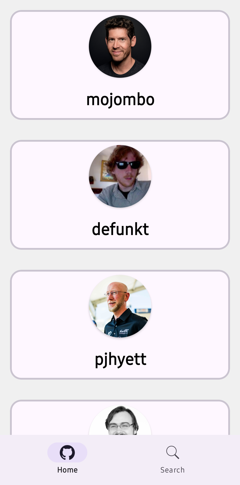
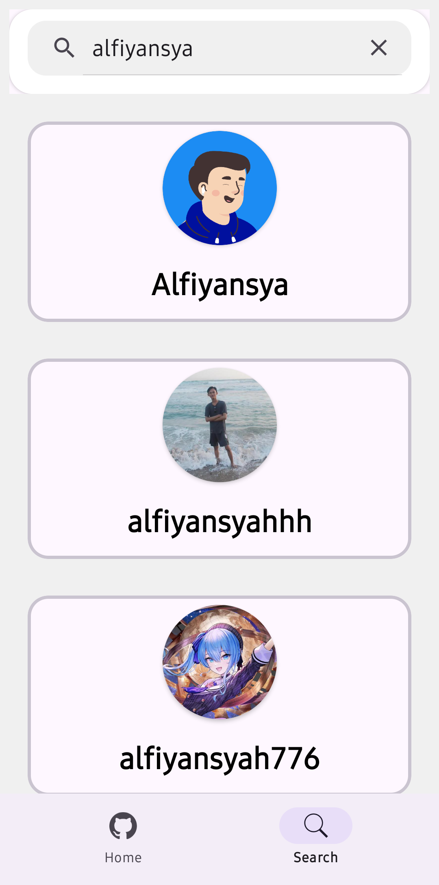
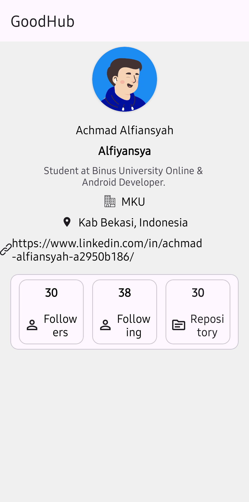

# GoodHubViews

A clean-architecture Android app for exploring GitHub users and repositories with a modern UI and a solid offline-first data layer.

<p align="left">
  <!-- Uncomment and replace with your badges
  <a href="#"></a>
  
  <a href="#license"></a>
  -->
</p>

> **Why**: This project demonstrates production-ready Android practices—modularization, dependency injection, caching, pagination, testing, and CI—implemented on top of the public GitHub REST API.

---

## ✨ Features

* 🔎 **Search GitHub users** with input debounce and error handling
* 👤 **User details**: avatar, bio, followers, following, public repos
* 📴 **Offline-first** cache & refresh strategy
---

## 🧱 Tech Stack

* **Language**: Kotlin
* **UI**: XML (View system) with RecyclerView (Good Hub *Views* 😉)
* **Architecture**: Clean Architecture + MVVM (unidirectional data flow)
* **DI**: Hilt
* **Networking**: Retrofit + OkHttp + (Moshi)
* **Persistence**: Room
* **Pagination**: Paging 3
* **Async**: Coroutines + Flow
* **Image Loading**: Glide
* **CI**: GitHub Actions (build + test)

---

## 🧩 Modules

```
root
├─ app/          # Presentation layer, DI entry points
└─ core/         # Data + Domain + common utilities
```

**Core layering guideline**

```

app/          
├─ detail        
├─ di            # UseCase modules
├─ home
├─ image_preview
└─ profile

core/
├─ data          # DTO, retrofit services, db, repository impl
├─ di
├─ domain        # entities, use cases, repository interfaces
├─ ui
└─ utils         # helper, etc. 

```

---

## 🔌 API & Rate Limits

* Uses **GitHub REST API v3** (public endpoints).
* **Unauthenticated** requests are limited to **60 req/hour**. For development, set a **personal access token** to increase the limit.

### Configure API

Create `local.properties` (or use a Gradle build config / environment variable):

```properties
BASE_URL=https://api.github.com/
API_TOKEN=ghp_xxx   # optional; if present, send as: Authorization: token <TOKEN>
```

Add an `Interceptor` to inject the token when present.

---

## 🗃️ Data & Caching Strategy

* **NetworkBoundResource**-style flow for list/detail
* **Room** as single source of truth
* **Stale‑While‑Revalidate** for fast cold starts
* **Paging 3** for infinite scroll of users/repos

---

## 🧭 Architecture Overview

```
[UI] Views/Adapters ─▶ ViewModel (StateFlow)
        ▲                         │
        │                         ▼
   Navigation                UseCases (domain)
                                 │
                                 ▼
                           Repository (domain)
                                 │
                       ┌─────────┴─────────┐
                       ▼                   ▼
                     Retrofit           Room DB
                   (remote src)       (local src) 
```

**Principles**

* Immutable UI state (data classes)
* Clear error types (sealed classes)
* Dispatcher injection for testability
* Strict dependency direction: UI → Domain → Data

---

## 🛠️ Setup & Run

1. **Clone**

```bash
git clone https://github.com/Alfiyansya/GoodHubViews.git
cd GoodHubViews
```

2. **Configure secrets** (optional, for higher rate limits)

* Add `API_KEY` to `local.properties` or use `gradle.properties` + `BuildConfig`.

3. **Build**

```bash
./gradlew clean assembleDebug
```

4. **Run tests**

```bash
./gradlew test
# Instrumented tests (if any)
./gradlew connectedAndroidTest
```

---

## 🧪 Testing Notes

* Unit tests for use cases & repositories
* Fake/Mock API & DB
* Flow assertions with Turbine
* Robolectric/UI tests (optional)

---

## 🧰 Code Style

* Gradle Kotlin DSL (`*.kts`)
* Optional: Ktlint/Detekt via Gradle plugins

---

## 📦 CI/CD

* **GitHub Actions** workflow under `.github/workflows/` triggers on PR and pushes to main
* Jobs: `build`, `test` (extend with lint, unit/UITest matrix as needed)

---

## 📱 Screenshots

<p align="center">
  <!-- Replace with your actual images/gifs -->
  
  
  
</p>

---

## 🔒 Security Notes

* Never commit tokens or API keys
* Use Gradle secrets/`local.properties`/CI variables

---

## 🗺️ Coming Up

* [✅] Release APKs via GitHub Actions
* [ ] Advanced filters (location, language)
* [ ] Manage & clear user search history
* [ ] UI test suite

---

## 🤝 Contributing

1. Fork and create a feature branch
2. Use conventional commit messages
3. Open a PR with a clear description and demo

---

## 📄 License

This project is licensed under the **MIT License**.

---

## 🙌 Acknowledgements

* GitHub REST API v3
* Android Jetpack libraries

---

## 📚 Dependency Snippets (example)

```kotlin
// Retrofit / OkHttp
implementation("com.squareup.retrofit2:retrofit:2.11.0")
implementation("com.squareup.retrofit2:converter-moshi:2.11.0")
implementation("com.squareup.okhttp3:okhttp:4.12.0")

// Hilt
kapt("com.google.dagger:hilt-compiler:2.52")
implementation("com.google.dagger:hilt-android:2.52")

// Room
implementation("androidx.room:room-runtime:2.6.1")
kapt("androidx.room:room-compiler:2.6.1")
implementation("androidx.room:room-ktx:2.6.1")

// Paging 3
implementation("androidx.paging:paging-runtime-ktx:3.3.2")

// Coroutines
implementation("org.jetbrains.kotlinx:kotlinx-coroutines-android:1.9.0")

// Glide
implementation("com.github.bumptech.glide:glide:4.16.0")
kapt("com.github.bumptech.glide:compiler:4.16.0")
```

> Replace versions with what you actually use. This section is optional but handy for readers.
